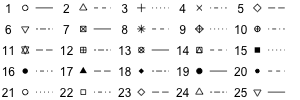

# Guide to R Commands

This list is meant to be used as a reference. Seeing all the commands at once can be overwhelming. You should follow the [labs](labs.md) for a more smooth introduction to programming in R.

The main use of this guide is to find out the common options that can be added to these commands. Throughout the guide, sections enclosed in angle brackets like this: `<dataset>` are placeholders meant to be replaced by the appropriate text for your data.

- [Data Preparation](#data-preparation)
    - read_csv
    - data
    - View
    - head
    - tail
    - filter
- [Summaries](#summaries)
    - [The formula interface](#the-formula-interface)
    - piping (%>%)
    - [summary](#summary)
    - [tally](#tally)
    - [aggregating functions (mean, median, sd, cor, var, favstats, range, iqr, sum, prod, min, max)](#aggregating-functions)
- [Plotting](#plotting)
    - [Common graph options](#common-graph-options)
    - [Color specifications](#color-specifications)
    - [histogram](#histogram)
    - [barchart](#barchart)


## Data Preparation

Commands in this section involve data preparation, for instance loading new data.

TODO

## Summaries

Commands in this section produce numerical summaries.

### The Formula Interface

Most of the commands we are using expect the variables to be specified via a formula interface. A formula in general looks as follows:
```r
<lhs>~<rhs>|<groups>
```
Here the left-hand-side may be completely absent and the vertical line and `groups` part may also be absent. Both sides contain the variables to be considered, and multiple variables can be separated by a plus sign.

lhs
  ~ The variables on the left-hand-side are the target variables and we are interested in how they are influenced by the other variables. When doing a scatterplot, `lhs` corresponds to the y axis.

rhs
  ~ The variables on the right-hand-side are the source variables and we are interested in themselves if there is no left-hand-side, or how they influence the variables in the left-hand-side if there are any.

groups
  ~ The variables in the groups section are meant to be variables used to break down the results. If used in a graph situation for example, the graph would have a different panel for each value of the group variables.

#### Examples

```r
# Looking at general health on its own
~genhealth
# Compare physical health against mental health,
# break down by general health category
physhealth~menthealth|genhealth
# Look at both physical health and mental health
~physhealth+menthhealth
```

### `summary`

`summary` can be used on the whole dataset, to get a quick overview of the various variables and their summaries.

#### Options

Typically you do not need to add any options to this method.

- `digits`: You can control how many digits are shown by adding the `digits=...` option.
- `maxsum`: You can determine how many categories (including the missing values category) will show from factors by adding the `maxsum=...` option. The most frequent categories are shown first.

#### Examples

```r
summary(brfss, digits=3, maxsum=6)
```

### `tally`

`tally` is used to produce frequency tables and cross-tabulation tables for categorical variables. The first argument should be a formula involving the variables to use, and it should be followed by a `data=<dataset>` option specifying which dataset to use.

#### Options

By default `tally` will create a table of frequencies for the various combinations of values.

- `sort`: You can specify `sort=TRUE` if you want to options to be sorted in order of frequency. By default they will be ordered in the order specified in the variable.
- `format`: By default `tally` will produce frequency counts. You can change that behavior with the `format` option. Most common values are `"count"` (the default), `"percent"`, `"proportion"` and `"data.frame"` (produces a dataset of the results, useful for further processing).
- `margins`: You can add the option `margins=TRUE` if you would like to see marginal probabilities (totals) added to the table.
- `useNA`: You can add `useNA="no"` to remove the missing values from the computations and the result.

#### Examples

```r
# There is a higher percent of Very Good/Excellent health people amongst those
# that exercise vs those that do not.
tally(~genhealth|exerciseany, data=brfss, format="percent", useNA="no")
```

### Aggregating Functions

There is a long list of commands that all follow a similar syntax, and all aggregate values of some variable, possibly broken down by other categorical variables. They all have the syntax:
```
<command>(<formula>, ...options)
```
The formula has the form `<aggregatingVariable>~<breakDown1>+<breakDown2>...` where the variable on the LHS is the scalar variable to be aggregated, and the variables in the RHS are the categorical variables by which to break the groups down.

The usual commands are:

- `mean` for the variable's mean
- `median` for the variable's median
- `sd` for the standard deviation
- `var` for the variance (square of standard deviation)
- `iqr` for the interquartile range
- `favstats` for the five-number summary, mean, median and count
- `range` for the range of the values (maximum minus minimum)
- `max` for the maximum of the values
- `min` for the minimum of the values
- `sum` for the sum of the values
- `prod` for the product of the values

#### Options

All commands accept the same options:

- `data`: add `data=<dataset>` to specify the dataset to use
- `na.rm`: add `na.rm=TRUE` to remove the missing values before computing. Most of the functions above will simply return `NA`, representing missing value, if there are any missing values present and `na.rm=TRUE` was not added.

#### Examples
```r
# Stats on number of days per month with physical/mental health problems,
# broken down by general health
mean(physhealth~genhealth, data=brfss, na.rm=TRUE)
mean(menthealth~genhealth, data=brfss, na.rm=TRUE)
favstats(menthealth~genhealth, data=brfss, na.rm=TRUE)
# Total state population by adding the county populations
sum(pop2010~state, data=counties, na.rm=TRUE)
# Stats for percent of blacks in county, broken down by state
favstats(black~state, data=counties, na.rm=TRUE)
```

## Plotting

Commands in this section produce graphical summaries. Before we look at individual commands, we discuss options common to most graphs.

### Common Graph Options

These options can be added to most graph commands:

- `xlab="..."` specifies the label for the x axis.
- `ylab="..."` specifies the label for the y axis.
- `main="..."` specifies the main graph title, which appears at the top.
- `col=...` specifies what colors to use for the various elements. Look at the [Color Specifications](#color-specifications) section for more details.
- `pch=...` can be used on graphs with points to choose what point-style to use. The options are summarized in this image:

    

    The icons 21-25 can use a fill-in (background) color, via the `bg=...` command. Use `c(..., ...)` for multiple values.
- `lty=...` can be used on graphs with lines to choose the line style to use. The graph above shows the options for line types. Use `c(..., ...)` for multiple values.
- `lwd=...` can be used on graphs with lines to specify the thickness of the lines, 1 being the standard size. For instance `lwd=1.4` will draw the lines 40% thicker.
- `cex=...` can be used to change the size of the objects in the graph, 1 being the standard size. For instance `cex=1.2` will draw the objects 20% bigger.
- `xlim=c(a, b)` sets the range on the x axis to be from `a` to `b`.
- `ylim=c(a, b)` sets the range on the y axis to be from `a` to `b`.
- `auto.key`: This option is used to insert a legend based on the grouping variable. Its form is `auto.key=list(...)` where the dotted area may be empty or contain any of the following options:
    - `space="..."` will specify which side the legend goes in (top, bottom, left, right). The default is top.
    - `columns=...` will specify in how many columns to split the legend.

### Color Specifications

Graph colors can be specified in a variety of different ways. We outline these different ways here. They are to be used with the `col=...` graph option.

By name

: R has over 650 built-in color names that you can use. Run the command `colors()` to see the different options. An example use would be: `col=c("grey5", "skyblue3")`

By grayscale

: You can specify a degree of grayness by using the `gray(...)` function and specifying numbers between 0 (black) to 1 (white). An example use for 4 colors would be: `col=grey(0, 0.2, 0.5, 0.8)`

By palette

: The [colorBrewer](http://colorbrewer2.org/) library contains custom palettes designed for various uses. You can see all the different palettes and their names by using the command `display.brewer.all()`. They fall into three categories:

    - *sequential palettes*, starting from a fairly white color and getting progressively darker. Good for ordered categorical data.
    - *diverging palettes*, with a middle neutral color and diverging in two directions. Good for ordered categorical data with a middle neutral value and negative/positive sides.
    - *qualitative palettes*, with easy to distinguish colors, useful for nominal (unordered) categorical variables.

    In order to use a palette, you would use the command `brewer.pal(<n>, <name>)` where `<n>` is the number of colors to choose, and `<name>` is the palette's name, in quotes. For instance to use four colors from the "Accent" palette we would do: `col=brewer.pal(4, "Accent")`

### `histogram`

`histogram` is used to produce histograms. The typical syntax would use a formula `~<variable>` as the first argument, followed by a `data=<dataset>` option to specify the dataset to use.

You can also create multiple panels based on the values of a categorical variable, with a formula `~<variable>|<factorVariable>`.

#### Options

- `breaks` can be used in two ways, but the simplest one is to set it equal to a single number, specifying the number of breakpoints to be used for the histogram bars.
- `type` must equal one of `"percent"`, `"count"` or `"density"` and determines what the heights of the bars correspond to:
    - `"count"` means the height of each bar corresponds to the number of cases in that range. If you were to change the default type, this is probably what you would choose instead.
    - `"percent"` (the default) means that the height of each bar corresponds to the percent of cases in that range.
    - `"density"` means that the *area* of each bar corresponds to the percent of cases in that range.

#### Examples

```r
histogram(~black, data=counties, breaks=40, col="green")
histogram(~physhealth|genhealth, data=brfss)
```

### `barchart`

`barchart` is used to produce bar charts. It is typically used by first doing a `tally` and then piping the result into `barchart`.

#### Options

- `horizontal`: By default the bars will be horizontal. If you would prefer vertical bars, add the option `horizontal=FALSE`.

#### 100% Stacked Bar Charts

100% stacked bar charts are somewhat tricky to make. We start with a `tally` with the two variables separated by a vertical line (not plus!), then set the format to `percent`. Before piping that into a barchart, however, we have to pipe it through the `t` command, which transposes columns and rows. The main syntax would look like this:
```r
tally(~genhealth|exerciseany, data=brfss, format="percent") %>% t() %>%
    barchart(auto.key=list(space="right"))
```
You may have to swap the two variables to get them in the desired order.

#### Examples

```r
tally(~genhealth, data=brfss) %>% barchart(horizontal=FALSE)
```


- bargraph (mosaic)  MIGHT NOT NEED?
- barchart (lattice)  barchart better for Pareto charts...
- mosaicplot (mosaic)
- xyplot (lattice)
- ladd (mosaic)
- panel.abline (lattice)
- ...


## Cleanup

- tally (mosaic)
- head, tail (base)
- summary (base)
- names (base)  MIGHT NOT NEED
- arrange (dplyr)  MIGHT NOT NEED
- favstats (mosaic)
- sort (base)
- %>% (dplyr)
- filter (dplyr)
- tally(~state, data=counties) %>% sort()
- median et al from mosaic (  median(~pop2010|state, data=counties)  )
- View (rstudio)
- pdist, xpnorm, xqnorm, xpbinom (mosaic)  FOR VISUALIZING THEORETICAL DISTRIBUTIONS
